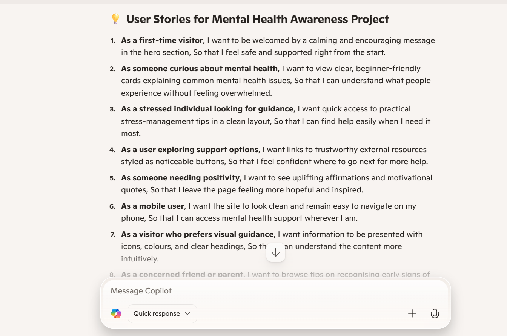
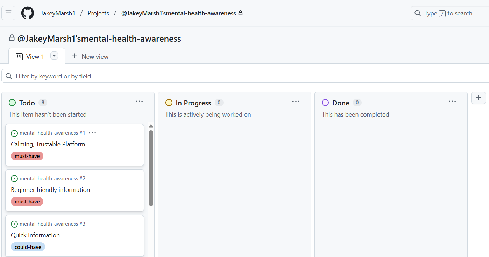
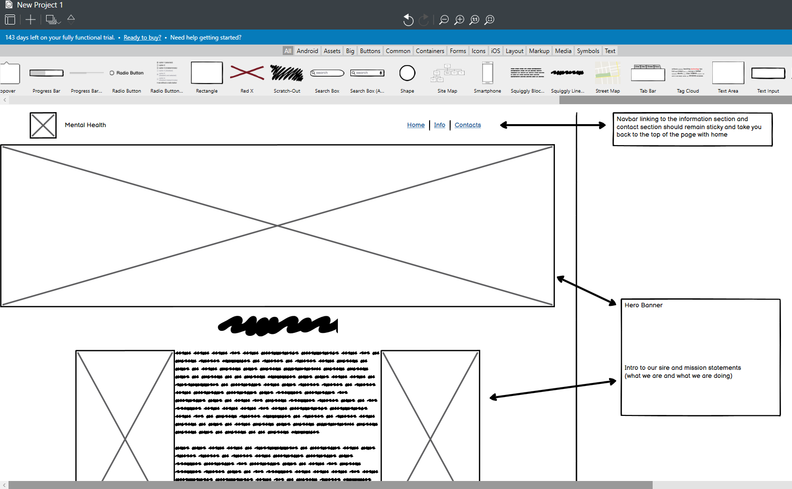
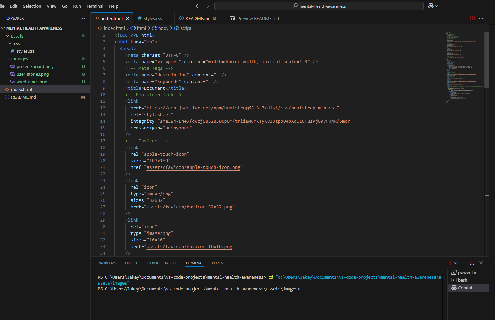
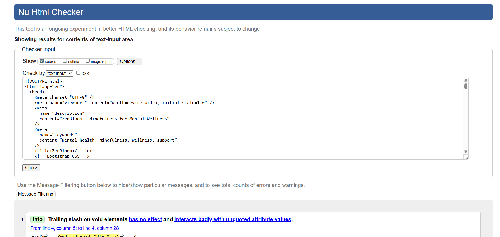
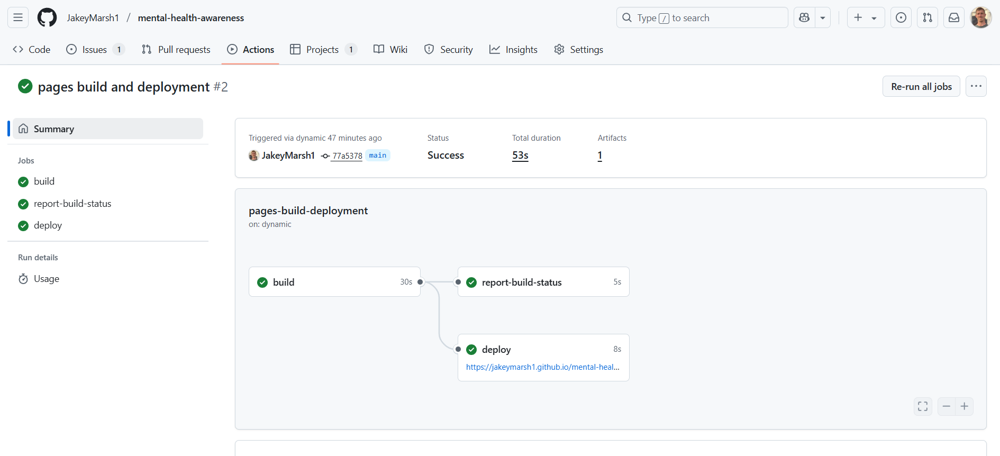

# Mental Health Awareness

---

# 📑 Table of Contents

- [Introduction](#introduction)
- [Construction](#construction)
  - [User Stories](#planning-and-user-stories)
  - [Project Management](#project-management-setup)
  - [Wireframing](#visual-design-and-wireframing)
  - [Setup](#technical-setup)
  - [Validation](#code-quality-and-validation)
  - [Deployment](#deployment)
- [Features](#features)
- [Testing and Deployment](#testing)
- [Future Development](#future-development)
- [Credits](#credits)

---

## 🌟 Introduction

The Mental Health Awareness project is a welcoming, single-page web platform designed to provide accessible, beginner-friendly mental health information. The site helps users recognize common mental health issues and discover practical stress management techniques through a supportive, well-organized layout.

Built with HTML, CSS, and Bootstrap, the project emphasizes a clean, calming design with carefully chosen colors and thoughtful organization. The site features Bootstrap components including information cards, resource grids, and positive messaging sections to create an encouraging user experience that feels supportive rather than overwhelming.

**Key objectives of this project:**
- Provide accessible mental health information for all knowledge levels
- Create a non-intimidating, supportive environment for learning
- Demonstrate effective Bootstrap implementation for clean, organized design
- Present stress management tools and resources in a visually appealing format
- Foster mental health awareness through positive, encouraging content

---

## 🔨 Construction

The development process for this project followed a structured, user-centered approach:

### Planning and User Stories
---
User stories were developed with GitHub Copilot using the format "As a [user type], I want [goal] so that [benefit]." These focused on calming design, accessible information, and intuitive navigation. Acceptance criteria served as actionable checklists, ensuring features met user needs like clear headings and proper color contrast for accessibility.

*Figure 1: User story development and acceptance criteria*

### Project Management Setup
---
A GitHub repository was created and linked to a GitHub project for streamlined management. User stories were converted to actionable to-do items and prioritized using the MoSCoW method (Must, Should, Could, Won't have).

*Figure 2: GitHub Project Board showing user stories organized by priority*

#### Visual Design and Wireframing
---
Visual layouts were created using wireframes, following mobile-first design principles. The wireframes evolved throughout development to optimize the user experience.

*Figure 3: Mobile and desktop wireframes showing responsive design approach*

#### Technical Setup
---
Development environment was configured in VS Code with HTML boilerplate, relevant links, and scripts. This foundation was uploaded to GitHub, establishing version control from project inception.

*Figure 4: VS Code development environment and initial project structure*

#### Code Quality and Validation
---
GitHub Copilot was used as a prescreener for debugging and code checking. Code was thoroughly commented for maintainability. Both HTML and CSS passed W3C and Jigsaw validators with no errors. CSS media queries ensured responsiveness across screen sizes, with accessibility prioritized.

*Figure 5: W3C HTML and CSS validation results showing no errors*

#### Deployment
---
The page was launched via GitHub Pages for seamless Git workflow integration. This method ensures the live site reflects the latest committed changes, maintains repository-production consistency, and provides a clear audit trail through Git history.

*Figure 6: GitHub Pages deployment settings and live site confirmation*

---

## ⭐ Features

---

## 🧪 Testing and Deployment

---

## 🚀 Future Development

**User Story:**  
I want quick access to practical stress-management tips in a clean layout, so that I can find help easily when I need it most.

**Acceptance Criteria:**
- A section features at least 3 actionable stress tips using icons or headings.
- The section is easy to scan, with bullet points or short segments.
- Content is written in a gentle, reassuring tone.

**Tasks:**
- Create a new section styled with Bootstrap’s text and spacing utilities.
- Include simple icons from Font Awesome or Bootstrap Icons for each tip.
- Format content using Bootstrap’s list styles or grid layout.

<strong>Other Future Suggestions</strong>

- Add a positive affirmations carousel with uplifting quotes.
- Integrate a resource finder for local or online mental health support.
- Implement a dark mode toggle for improved accessibility.

---

## 🙏 Credits

**Credits**

- **Bootstrap**  
  [Bootstrap 5](https://getbootstrap.com/) is used for responsive layout, components, and styling.  
  CDN: [jsdelivr](https://www.jsdelivr.com/)

- **Google Fonts**  
  [Raleway](https://fonts.google.com/specimen/Raleway) and [Roboto Mono](https://fonts.google.com/specimen/Roboto+Mono) via [Google Fonts](https://fonts.google.com/)

- **Font Awesome**  
  [Font Awesome](https://fontawesome.com/) is used for icons.  
  CDN: [kit.fontawesome.com](https://kit.fontawesome.com/)

- **Favicons**  
  Favicon images in `assets/favicon/` (if sourced externally, add attribution; if generated, note the generator or tool used)

- **GitHub Copilot**  
  Used for code suggestions, user story development, and debugging assistance.

- **jsDelivr CDN**  
  Used to serve Bootstrap CSS and JS.

If you used any images, illustrations, or other assets from external sources (e.g., Unsplash, Pexels, or icon libraries), be sure to add those credits as well.