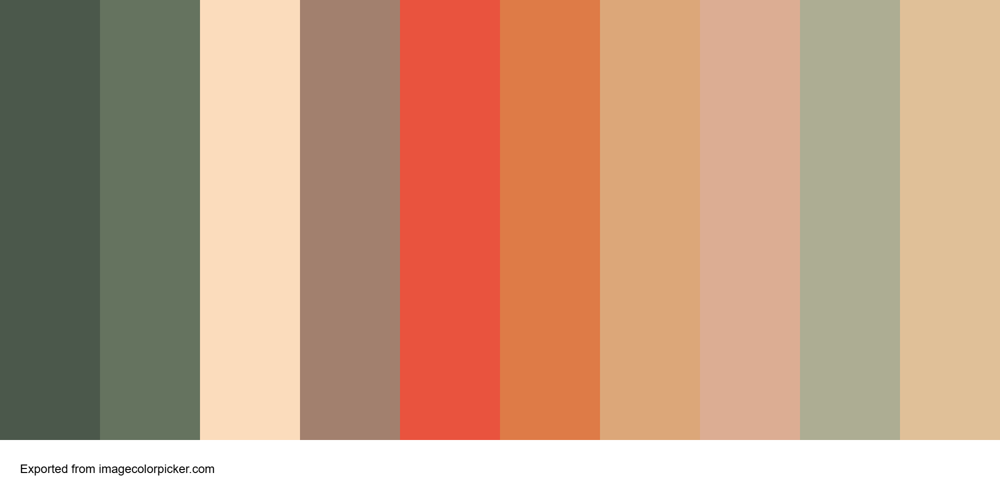

# 🧠 Mental Health Awareness

---

## 📑 Table of Contents

- [🌟 Introduction](#-introduction)
- [🔨 Construction](#-construction)
  - [🧩 Planning and User Stories](#planning-and-user-stories)
  - [🗂️ Project Management Setup](#project-management-setup)
  - [📐 Visual Design and Wireframing](#visual-design-and-wireframing)
  - [💻 Technical Setup](#technical-setup)
  - [✅ Code Quality and Validation](#code-quality-and-validation)
  - [🚀 Deployment](#deployment)
- [⭐ Features](#-features)
- [🧪 Testing and Deployment](#-testing-and-deployment)
- [🤖 AI Tool Reflection](#-ai-tool-reflection)
- [📈 Future Development](#-future-development)
- [🙏 Credits](#-credits)
- [💬 Final Thoughts](#-final-thoughts)

---

## 🌟 Introduction

**Purpose:**  
Educate, support, and guide users with beginner-friendly mental health information in a calm, accessible way.

**Audience:**  
People new to mental health topics or feeling stressed, seeking gentle guidance and clarity.

This project is a friendly, easy-to-use web page designed to help users learn about mental health in a supportive way. It features simple explanations of common challenges, practical stress management tips, and links to trusted organizations. The calming design and clear layout—built with Bootstrap—make information easy to find for all users.

**Key goals:**
- 🧼 Clean, welcoming layout using Bootstrap  
- 🧠 Clear structure and accessibility via UX principles and semantic HTML  
- 🔍 Validated custom code (W3C/Jigsaw)  
- 📱 Responsive design for all devices  
- ☁️ Cloud deployment with version control and commented code  
- 📝 Concise README with project purpose and value  
- 🤖 Reflection on AI tools’ impact on performance and user experience

---

## 🔨 Construction

### 🧩 Planning and User Stories

User stories followed the format:  
*As a [user type], I want [goal] so that [benefit].*  
Copilot assisted with defining purpose, color palettes, layout clarity, and accessibility strategy.

  
*Figure 1: Chosen color palette for calming aesthetics*

  
*Figure 2: Developed user stories and acceptance criteria*

### 🗂️ Project Management Setup

Tasks were organized via GitHub Project Board and prioritized using the MoSCoW method.

  
*Figure 3: GitHub task tracking and prioritization*

### 📐 Visual Design and Wireframing

Wireframes were created using a mobile-first approach to ensure responsive design and user clarity.

  
*Figure 4: Mobile and desktop wireframes*

### 💻 Technical Setup

VS Code was configured with basic HTML boilerplate, Bootstrap via CDN, and organized file structure.

  
*Figure 7: Initial coding environment and folder structure*

### ✅ Code Quality and Validation

- Semantic HTML  
- ARIA labels  
- Commented CSS  
- Validated via W3C and Jigsaw  
- Autoprefixer used for cross-browser compatibility

  
*Figure 8: W3C validation results*

.png)  
*Figure 5: Lighthouse Mobile*

.png)  
*Figure 6: Lighthouse Desktop*

### 🚀 Deployment

The project was deployed via GitHub Pages, with commit history and live auditing.

  
*Figure 9: GitHub Pages configuration and success message*

---

## ⭐ Features

- 🎨 Hero section with calming visuals  
- 🧾 Information cards summarizing topics and tips  
- ✨ Positive affirmations carousel  
- 🔗 Resource links to trusted organizations and helplines  
- 📱 Responsive design across all devices  
- 🌐 Accessible navigation and smooth scrolling  
- 📨 Contact form with required fields  
- ⚓ Footer with social links and copyright  
- 🧠 Semantic HTML & ARIA labels  
- ✅ Validated code using official validators

---

## 🧪 Testing and Deployment

- 🧪 Lighthouse scores in the 90s (Accessibility, SEO, Best Practices)  
- 🎯 Fixed contrast issues, added alt text, and compressed images  
- ⚙️ Meta descriptions added for SEO  
- ✅ CSS processed and validated  
- 🌍 Site live at [jakeymarsh1.github.io/mental-health-awareness](https://jakeymarsh1.github.io/mental-health-awareness/)

---

## 🤖 AI Tool Reflection

AI tools played a strategic role in supporting this project:

- ✨ **Code Generation:** Semantic HTML layout, responsive Bootstrap grid, navigation logic  
- 🎨 **Design Choices:** Color palette selection, accessible font pairing, layout guidance  
- 🪲 **Debugging Assistance:** Helped resolve validation errors and layout spacing issues  
- 🚀 **Optimization:** Improved animation performance and smooth scrolling  
- 📈 **Workflow Enhancement:** Accelerated prototyping and reduced debugging time

---

## 📈 Future Development

**New user story:**  
*Quick access to stress-management tips in a calm format.*

**Acceptance Criteria:**
- ✅ At least 3 actionable tips with headings/icons  
- 📊 Scannable layout using cards or grid  
- 💬 Gentle and supportive language

**Planned additions:**
- 📋 Stress tips section with Bootstrap cards  
- 🌗 Dark mode toggle  
- 🔍 Resource finder for local support  
- ⏭️ Add skip-to-content accessibility link

<strong>More future ideas...</strong>

- 🌼 Expand positive affirmations section  
- 🧘 Add breathing exercise animations  
- 📈 Integrate chatbot for personalized tips  
- ✉️ Newsletter opt-in via contact form  

---

## 🙏 Credits

- **Frameworks & Libraries:**  
  - [Bootstrap 5](https://getbootstrap.com/) via [jsDelivr](https://www.jsdelivr.com/)  
  - [Font Awesome](https://fontawesome.com/) via CDN  
  - [Google Fonts: Raleway](https://fonts.google.com/specimen/Raleway), [Roboto Mono](https://fonts.google.com/specimen/Roboto+Mono)

- **Design Tools:**  
  - Balsamiq, Image Color Picker, Remove.bg, Simple Image Resizer

- **Utilities & Validation:**  
  - Chrome Lighthouse, W3C/Jigsaw Validators, Autoprefixer

- **Development Support:**  
  - GitHub Copilot – semantic structure, debugging, responsive layout, image suggestions  
  - VS Code and GitHub for version control

- **Imagery:**  
  - Icons via Font Awesome  
  - Background images from [Unsplash](https://unsplash.com/) licensed under the Unsplash License  
  - All screenshots and wireframes in [assets/images-readme/](assets/images-readme/)

---

## 💬 Final Thoughts

This site is more than code — it's a safe place, a calm space, and a gentle nudge toward understanding. Designed with empathy, clarity, and accessibility in mind, this project aims to support anyone navigating stress or mental health topics, whether for the first time or simply needing a reminder: you are not alone.

---
